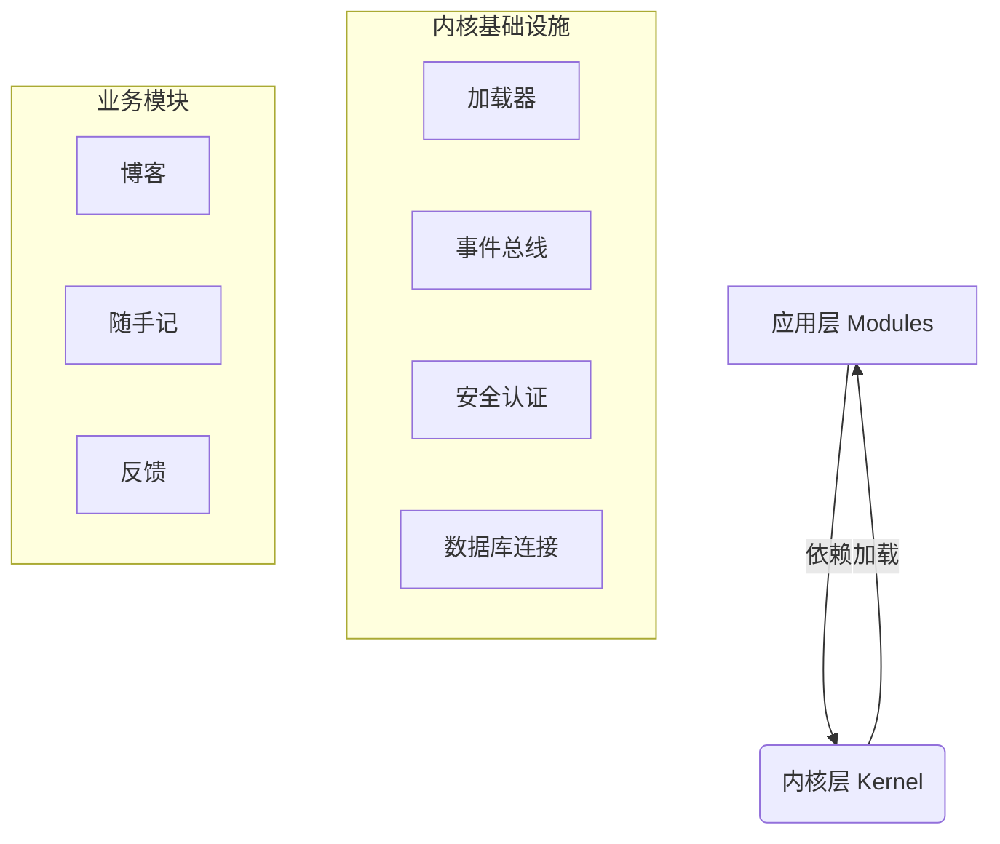

# JeJe WebOS 开发手册

> 📘 **开发规范与模块实战合集**
> 
> 本文档融合了系统开发规范与模块开发指南，既是架构约束的"法律法规"，也是业务开发的"操作手册"。

---

## 📑 目录

1. **[核心架构规范](#一-核心架构规范)** (Design Principles)
2. **[项目目录结构](#二-项目目录结构)** (Directory Structure)
3. **[通用开发标准](#三-通用开发标准)** (Naming & API Standards)
4. **[模块开发实战](#四-模块开发实战-module-development)** (Build Your App)
5. **[前端开发指南](#五-前端开发指南)** (Frontend Development)
6. **[三大戒律](#六-三大戒律-donts)** (Critical Rules)

---

## 一、核心架构规范

JeJe WebOS 采用 **微内核 (Micro-Kernel)** 架构，严格遵循以下设计原则：

### 1.1 架构分层
系统严格划分为 **内核层 (Kernel)** 与 **应用层 (Modules)**。



### 1.2 核心职责

| 组件 | 职责 | 🔴 禁区 |
| :--- | :--- | :--- |
| **内核 (Core)** | 提供账号、鉴权、数据库连接、事件总线等基础设施 | **严禁包含任何业务逻辑** (如文章、订单) |
| **模块 (Modules)** | 实现具体业务功能 (Blog, Notes) | **严禁直接 import 其他模块代码** |

---

## 二、项目目录结构

### 2.1 整体结构

```text
jeje_webos/
├── backend/                      # 🐍 后端 (FastAPI)
│   ├── core/                     # --- 内核层 (禁止修改) ---
│   │   ├── config.py             # 配置管理
│   │   ├── database.py           # DB 连接与 Session
│   │   ├── loader.py             # 模块加载器
│   │   └── security.py           # JWT 与 权限校验
│   ├── modules/                  # --- 应用层 (开发主战场) ---
│   │   ├── _template/            # 模块生成模板
│   │   ├── blog/                 # [示例] 博客模块
│   │   └── notes/                # [示例] 笔记模块
│   ├── routers/                  # 系统级路由 (Auth, System)
│   ├── models/                   # 系统级模型 (User, Role)
│   └── main.py                   # 启动入口
│
├── frontend/                     # 🎨 前端 (Vanilla JS)
│   ├── js/                       # --- 逻辑层 ---
│   │   ├── core/                 # 核心库 (Router, Store, Api)
│   │   ├── components/           # UI 组件 (Window, Dock)
│   │   └── pages/                # 页面组件
│   └── css/                      # --- 样式层 ---
```

### 2.2 模块内部结构 (`backend/modules/xxx/`)

每个业务模块必须遵循以下命名规范（强制带有模块前缀），以便于在 IDE 中快速区分：

| 文件名 | 必须 | 说明 |
| :--- | :---: | :--- |
| `__init__.py` | ✅ | 空文件，标记为 Python 包 |
| `{id}_manifest.py` | ✅ | **模块身份证**，定义名称、图标、权限、菜单 |
| `{id}_router.py` | ✅ | API 路由定义 |
| `{id}_models.py` | ✅ | 数据库表结构 (SQLAlchemy) |
| `{id}_schemas.py` | ✅ | 数据验证模型 (Pydantic) |
| `{id}_services.py` | ⚪ | 业务逻辑层 (推荐) |

> ℹ️ **说明**：为了防止在 IDE（如 VS Code）中搜索文件时出现大量同名文件（如 `router.py`），所有模块文件必须带有 `{module_id}_` 前缀。

---

## 三、通用开发标准

### 3.1 命名规范

| 对象 | 规范 | 示例 |
| :--- | :--- | :--- |
| **文件名** | `{module_id}_` 前缀 | `blog_router.py` |
| **类名** | PascalCase | `BlogPost`, `BlogService` |
| **变量/函数** | snake_case | `get_post_list`, `user_id` |
| **数据库表** | `{module_id}_` 前缀 | `blog_posts`, `sys_users` |
| **API 路径** | `/api/v1/{module}/{resource}` | `/api/v1/blog/posts` |

### 3.2 统一响应格式

所有 API 必须返回统一的 JSON 结构：

```json
// 成功
{ "code": 200, "message": "操作成功", "data": { ... } }

// 失败
{ "code": 400, "message": "参数错误", "data": null }

// 分页
{ 
    "code": 200, 
    "message": "success", 
    "data": { "items": [...], "total": 100, "page": 1, "size": 10 } 
}
```

---

## 四、模块开发实战 (Module Development)

本节指导你如何从零创建一个新模块（如 "待办事项" `todo`）。

### 🚀 方式一：使用 CLI 脚手架 (推荐)

**3秒钟生成完整模块：**

```bash
cd backend
python scripts/create_module.py todo 待办事项
```

此命令会自动生成后端代码 (`backend/modules/todo/`) 和前端代码 (`frontend/js/pages/todo.js`)。重启服务即可生效。

### 🛠️ 方式二：手动开发流程

#### 1. 定义清单 (`manifest.py`)
这是模块的入口，系统根据此文件加载模块。

```python
from core.loader import ModuleManifest

manifest = ModuleManifest(
    id="todo",
    name="待办事项",
    icon="✅",
    # 自动挂载路由: /api/v1/todo
    router_prefix="/api/v1/todo",
    
    # 自动注册前端菜单
    menu={
        "title": "待办",
        "icon": "✅",
        "path": "/todo",
        "children": [
            {"title": "我的待办", "path": "/todo/list", "icon": "📝"},
            {"title": "新建任务", "path": "/todo/add", "icon": "➕"}
        ]
    },
    
    # 定义权限点
    permissions=["todo.read", "todo.create"]
)
```

#### 2. 定义数据模型 (`models.py`)

```python
from core.database import Base
from sqlalchemy.orm import Mapped, mapped_column
from sqlalchemy import Integer, String

class TodoItem(Base):
    # ⚠️ 必须带模块前缀 todo_
    __tablename__ = "todo_items"
    
    id: Mapped[int] = mapped_column(Integer, primary_key=True)
    title: Mapped[str] = mapped_column(String(100))
```

#### 3. 编写 API (`router.py`)

```python
from fastapi import APIRouter, Depends
from core.database import get_db
from schemas import success  # 统一响应封装

router = APIRouter()

@router.get("/list")
async def get_list(db = Depends(get_db)):
    # ... 业务逻辑
    return success(data)
```

---

## 五、前端开发指南

JeJe WebOS 前端采用 **Vanilla JS Component** 模式，无需构建工具。

### 5.1 页面组件开发

在 `frontend/js/pages/` 中创建 `todo.js`：

```javascript
// 必须继承 Component 基类
class TodoPage extends Component {
    constructor(container) {
        super(container);
        // 定义响应式状态
        this.state = {
            list: [],
            loading: false
        };
    }

    // 渲染 HTML (类似 React render)
    render() {
        const { list } = this.state;
        return `
            <div class="page-todo">
                <h1>待办事项</h1>
                <ul>
                    ${list.map(item => `<li>${item.title}</li>`).join('')}
                </ul>
            </div>
        `;
    }

    // 生命周期：挂载后执行
    async afterMount() {
        // 调用后端 API (core/api.js 提供的封装)
        const res = await Api.get('/todo/list');
        // 更新状态，自动触发 render
        this.setState({ list: res.data.items });
    }
}
```

### 5.2 注册路由

在 `app.js` 中注册你的页面：

```javascript
'/todo/list': { 
    auth: true, 
    handler: wrap(TodoPage, '待办事项') 
}
```

---

## 六、三大戒律 (Don'ts)

| 戒律 | 说明 | 后果 |
| :--- | :--- | :--- |
| 🔴 **严禁后端渲染 HTML** | 后端只能返回 JSON。所有 UI 必须在前端 JS 中渲染。 | 破坏前后端分离架构，无法静态化部署。 |
| 🔴 **严禁跨模块 Import** | 模块之间禁止 `from modules.blog import x`。 | 导致模块强耦合，无法独立热插拔。请使用 **事件总线** 通信。 |
| 🔴 **严禁私造响应格式** | 必须使用 `schemas.success()` 等工具函数。 | 导致前端 API 解析器无法统一处理错误。 |
