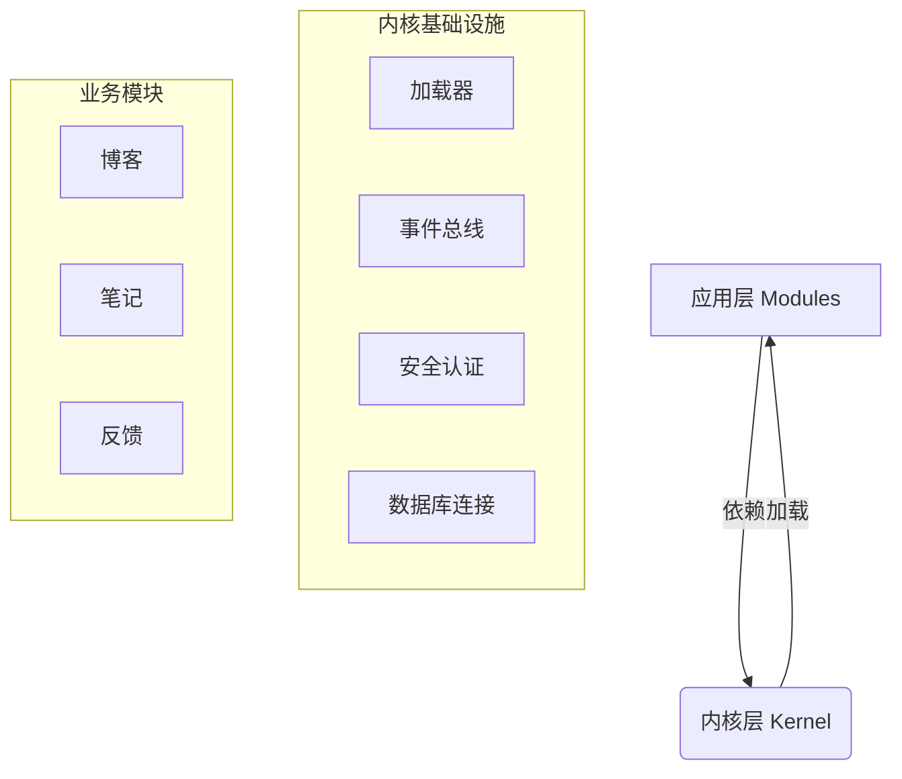

# JeJe WebOS 开发手册

> 📘 **开发规范与模块实战合集**
> 
> 本文档融合了系统开发规范与模块开发指南，既是架构约束的"法律法规"，也是业务开发的"操作手册"。

---

## 📑 目录

1. **[核心架构规范](#一-核心架构规范)** (Design Principles)
2. **[项目目录结构](#二-项目目录结构)** (Directory Structure)
3. **[通用开发标准](#三-通用开发标准)** (Naming & API Standards)
4. **[模块开发实战](#四-模块开发实战-module-development)** (Build Your App)
5. **[前端开发指南](#五-前端开发指南)** (Frontend Development)
6. **[三大戒律](#六-三大戒律-donts)** (Critical Rules)

---

## 一、核心架构规范

JeJe WebOS 采用 **微内核 (Micro-Kernel)** 架构，严格遵循以下设计原则：

### 1.1 架构分层
系统严格划分为 **内核层 (Kernel)** 与 **应用层 (Modules)**。



### 1.2 核心职责

| 组件 | 职责 | 🔴 禁区 |
| :--- | :--- | :--- |
| **内核 (Core)** | 提供账号、鉴权、数据库连接、事件总线等基础设施 | **严禁包含任何业务逻辑** (如文章、订单) |
| **模块 (Modules)** | 实现具体业务功能 (Blog, Notes) | **严禁直接 import 其他模块代码** |

---

## 二、项目目录结构

### 2.1 整体结构

```text
jeje_webos/
├── backend/                      # 🐍 后端 (FastAPI)
│   ├── core/                     # --- 内核层 (禁止修改) ---
│   │   ├── config.py             # 配置管理
│   │   ├── database.py           # DB 连接与 Session
│   │   ├── loader.py             # 模块加载器
│   │   └── security.py           # JWT 与 权限校验
│   ├── modules/                  # --- 应用层 (开发主战场) ---
│   │   ├── _template/            # 模块生成模板
│   │   ├── blog/                 # [示例] 博客模块
│   │   └── notes/                # [示例] 笔记模块
│   ├── routers/                  # 系统级路由 (Auth, System)
│   ├── models/                   # 系统级模型 (User, Role)
│   └── main.py                   # 启动入口
│
├── frontend/                     # 🎨 前端 (Vanilla JS)
│   ├── js/                       # --- 逻辑层 ---
│   │   ├── core/                 # 核心库 (Router, Store, Api)
│   │   ├── components/           # UI 组件 (Window, Dock)
│   │   └── pages/                # 页面组件
│   └── css/                      # --- 样式层 ---
```

### 2.2 模块内部结构 (`backend/modules/xxx/`)

每个业务模块必须遵循以下命名规范（强制带有模块前缀），以便于在 IDE 中快速区分：

| 文件名 | 必须 | 说明 |
| :--- | :---: | :--- |
| `__init__.py` | ✅ | 空文件，标记为 Python 包 |
| `{id}_manifest.py` | ✅ | **模块身份证**，定义名称、图标、权限、菜单、生命周期钩子 |
| `{id}_router.py` | ✅ | API 路由定义 |
| `{id}_models.py` | ✅ | 数据库表结构 (SQLAlchemy) |
| `{id}_schemas.py` | ✅ | 数据验证模型 (Pydantic) |
| `{id}_services.py` | ⚪ | 业务逻辑层 (推荐)，复杂模块可按功能拆分多个 service 文件 |
| `tests/` | ⚪ | 模块测试目录（推荐），包含 `__init__.py` 和 `test_{id}.py` |

> ℹ️ **说明**：为了防止在 IDE（如 VS Code）中搜索文件时出现大量同名文件（如 `router.py`），所有模块文件必须带有 `{module_id}_` 前缀。

---

## 三、通用开发标准

### 3.1 命名规范

| 对象 | 规范 | 示例 |
| :--- | :--- | :--- |
| **文件名** | `{module_id}_` 前缀 | `blog_router.py` |
| **类名** | PascalCase | `BlogPost`, `BlogService` |
| **变量/函数** | snake_case | `get_post_list`, `user_id` |
| **数据库表** | `{module_id}_` 前缀 | `blog_posts`, `sys_users` |
| **API 路径** | `/api/v1/{module}/{resource}` | `/api/v1/blog/posts` |

### 3.2 统一响应格式

所有 API 必须返回统一的 JSON 结构：

```json
// 成功
{ "code": 200, "message": "操作成功", "data": { ... } }

// 失败
{ "code": 400, "message": "参数错误", "data": null }

// 分页
{ 
    "code": 200, 
    "message": "success", 
    "data": { "items": [...], "total": 100, "page": 1, "size": 10 } 
}
```

### 3.3 数据库模型规范 (SQLAlchemy)

在使用 SQLAlchemy 定义数据模型时，必须遵守以下规则以避免 ORM 映射错误和热重载冲突：

1.  **严禁使用字符串引用**：
    - 在定义 `ForeignKey` 和 `relationship` 时，**必须使用模型类本身**（如 `ForeignKey(User.id)`），严禁使用字符串（如 `"sys_users.id"` 或 `"User"`）。
    - 字符串引用在模块热重载或动态加载时，会导致 "Multiple classes found" 或 "UnmappedColumnError" 等难以排查的错误。

2.  **跨模块关系处理**：
    - 避免在不同模块的模型之间定义双向 `relationship`。
    - 如果两个模块（如 `transfer` 和 `account`）相互依赖，不要使用 ORM 的 `relationship` 进行关联，而是仅保留 `ForeignKey` 字段。
    - 在业务逻辑层（Service）通过 ID 单独查询关联数据。这也是微服务架构的最佳实践。

3.  **避免使用 SQLAlchemy Enum 类型**：
    - 定义数据库列时，**尽量使用 `String` 类型代替 `Enum` 类型**。
    - 在 Python 代码中可以定义 `Enum` 类（建议继承 `str`, 如 `class Status(str, Enum)`) 用于业务逻辑判断。
    - 在 `Column` 定义中，使用 `String` 存储枚举值（例如 `Column(String(32), default=Status.PENDING.value)`）。
    - 原因：SQLAlchemy 的 Enum 类型在不同数据库（MySQL vs SQLite）下行为不一致，且在热重载场景下（Python 类重新定义）会导致类型校验失败（LookupError）。

4.  **避免过度配置**：
    - 不要手动指定 `primaryjoin` 或 `foreign_keys`，除非这是解决冲突的最后手段。SQLAlchemy 的自动推断通常比手动配置更可靠。

5.  **统一导入路径**：
    - 所有模块导入必须基于项目根目录（`backend`）。
    - 例如：`from modules.transfer.models import TransferSession`，不要使用相对导入 `..models`，这会导致同一个模块被加载两次（sys.modules 中存在两份），引发 ORM 注册冲突。

---

## 四、模块开发实战 (Module Development)

本节指导你如何从零创建一个新模块（如 "待办事项" `todo`）。

### 🚀 方式一：使用 CLI 脚手架 (推荐)

**3秒钟生成完整模块：**

```bash
cd backend
python scripts/create_module.py todo 待办事项
```

此命令会自动生成后端代码 (`backend/modules/todo/`) 和前端代码 (`frontend/js/pages/todo.js`)。重启服务即可生效。

### 🛠️ 方式二：手动开发流程

#### 1. 定义清单 (`manifest.py`)
这是模块的入口，系统根据此文件加载模块。

```python
from core.loader import ModuleManifest, ModuleAssets
import logging

logger = logging.getLogger(__name__)

# 生命周期钩子（可选）
async def on_install():
    """模块安装时执行（如初始化数据）"""
    logger.info("模块正在安装...")

async def on_enable():
    """模块启用时执行"""
    logger.info("模块已启用")

async def on_disable():
    """模块禁用时执行"""
    logger.info("模块已禁用")

manifest = ModuleManifest(
    # 基本信息
    id="todo",
    name="待办事项",
    version="1.0.0",
    description="简单高效的待办事项管理",
    icon="✅",
    author="JeJe WebOS",
    
    # 路由配置：自动挂载到 /api/v1/todo
    router_prefix="/api/v1/todo",
    
    # 菜单配置：自动注册到前端侧边栏
    menu={
        "title": "待办",
        "icon": "✅",
        "path": "/todo",
        "order": 10,  # 菜单排序权重
        "children": [
            {"title": "我的待办", "path": "/todo/list", "icon": "📝"},
            {"title": "新建任务", "path": "/todo/add", "icon": "➕"}
        ]
    },
    
    # 前端资源（留空则自动发现 static/ 目录）
    assets=ModuleAssets(css=[], js=[]),
    
    # 权限声明
    permissions=["todo.read", "todo.create", "todo.update", "todo.delete"],
    
    # 模块依赖（其他模块ID列表）
    dependencies=[],
    
    # 内核版本要求
    kernel_version=">=1.0.0",
    
    # 是否启用
    enabled=True,
    
    # 生命周期钩子绑定
    on_install=on_install,
    on_enable=on_enable,
    on_disable=on_disable,
)
```

#### 2. 定义数据模型 (`models.py`)

```python
from core.database import Base
from sqlalchemy.orm import Mapped, mapped_column
from sqlalchemy import Integer, String

class TodoItem(Base):
    # ⚠️ 必须带模块前缀 todo_
    __tablename__ = "todo_items"
    
    id: Mapped[int] = mapped_column(Integer, primary_key=True)
    title: Mapped[str] = mapped_column(String(100))
```

#### 3. 编写 API (`router.py`)

```python
from fastapi import APIRouter, Depends
from core.database import get_db
from schemas import success  # 统一响应封装

router = APIRouter()

@router.get("/list")
async def get_list(db = Depends(get_db)):
    # ... 业务逻辑
    return success(data)
```

---

### 4.3 模块打包与发布

当模块开发完成后，你可以将其打包为 `.jwapp` 文件，以便分发或通过应用市场离线安装。

#### 1. 使用打包脚本 (推荐)

我们提供了快捷的打包工具：

```bash
cd backend
# 格式: python scripts/pack_module.py <module_id>
python scripts/pack_module.py todo
```

命令执行成功后，会在项目根目录的 `dist/` 文件夹下生成 `todo.jwapp` 文件。

#### 2. 手动打包 (Manual)

`.jwapp` 本质上是一个 ZIP 压缩包，但必须遵循特定的目录结构：

```text
todo.jwapp (ZIP Archive)
└── todo/                   # 必须包含一层以模块ID命名的根文件夹
    ├── __init__.py
    ├── todo_manifest.py
    ├── todo_router.py
    └── ...
```

> ⚠️ **注意**：压缩包内**必须**包含顶层的文件夹（如 `todo/`），不能直接将文件放在压缩包根目录，否则会导致安装失败或文件冲突。

---

### 4.4 模块测试规范

为保证模块质量，建议为每个模块编写单元测试。测试文件应放在模块内部的 `tests/` 目录下，这样当模块被删除时，测试文件也会一并清理。

#### 1. 目录结构

```text
modules/todo/
├── __init__.py
├── todo_manifest.py
├── todo_router.py
├── todo_services.py
└── tests/                  # 测试目录
    ├── __init__.py         # 必须
    └── test_todo.py        # 测试文件
```

#### 2. 测试示例

```python
# modules/todo/tests/test_todo.py
import pytest
import sys
import os
sys.path.insert(0, os.path.dirname(os.path.dirname(os.path.dirname(os.path.dirname(os.path.abspath(__file__))))))

from modules.todo.todo_services import TodoService

class TestTodoService:
    def test_create_todo(self):
        """测试创建待办"""
        # ... 测试逻辑
        pass
```

#### 3. 运行测试

```bash
# 运行单个模块的测试
python -m pytest modules/todo/tests/ -v

# 运行所有模块测试
python -m pytest modules/*/tests/ -v

# 运行核心测试 + 模块测试
python -m pytest tests/ modules/*/tests/ -v
```

---

## 五、前端开发指南

JeJe WebOS 前端采用 **Vanilla JS Component** 模式，无需构建工具。

### 5.1 页面组件开发

在 `frontend/js/pages/` 中创建 `todo.js`：

```javascript
// 必须继承 Component 基类
class TodoPage extends Component {
    constructor(container) {
        super(container);
        // 定义响应式状态
        this.state = {
            list: [],
            loading: false
        };
    }

    // 渲染 HTML (类似 React render)
    render() {
        const { list } = this.state;
        return `
            <div class="page-todo">
                <h1>待办事项</h1>
                <ul>
                    ${list.map(item => `<li>${item.title}</li>`).join('')}
                </ul>
            </div>
        `;
    }

    // 生命周期：挂载后执行
    async afterMount() {
        // 调用后端 API (core/api.js 提供的封装)
        const res = await Api.get('/todo/list');
        // 更新状态，自动触发 render
        this.setState({ list: res.data.items });
    }
}
```

### 5.2 注册路由

在 `app.js` 中注册你的页面：

```javascript
'/todo/list': { 
    auth: true, 
    handler: wrap(TodoPage, '待办事项') 
}
```

### 5.3 JS/CSS 文件命名与存放规范

#### 5.3.1 文件命名规则

**核心原则：JS 和 CSS 文件必须一一对应，且文件名保持一致。**

| 文件类型 | 命名规则 | 示例 |
|---------|---------|------|
| **页面 JS** | `{module_id}.js` 或 `{module_id}_{page_name}.js` | `todo.js`, `analysis_chart.js` |
| **页面 CSS** | **必须与 JS 文件名完全一致** | `todo.css`, `analysis_chart.css` |
| **组件 JS** | `{component_name}.js` | `window.js`, `dock.js` |
| **组件 CSS** | **必须与 JS 文件名完全一致** | `window.css`, `dock.css` |

**规则说明：**
- ✅ **正确**：`analysis_smart_report.js` 对应 `analysis_smart_report.css`
- ❌ **错误**：`analysis_smart_report.js` 对应 `smart_report.css`（文件名不一致）
- ❌ **错误**：`todo.js` 对应 `todo_page.css`（文件名不一致）

#### 5.3.2 文件存放规则

**目录结构必须严格遵循以下规范：**

```text
frontend/
├── js/
│   ├── core/                    # 核心库（系统级）
│   │   ├── api.js
│   │   ├── router.js
│   │   └── ...
│   ├── components/             # UI 组件（可复用）
│   │   ├── window.js           # 窗口管理器
│   │   ├── dock.js             # Dock 栏
│   │   └── ...
│   └── pages/                  # 页面组件（业务逻辑）
│       ├── todo.js             # 简单页面
│       ├── analysis/           # 复杂模块（子目录）
│       │   ├── analysis.js
│       │   ├── analysis_chart.js
│       │   └── analysis_smart_report.js
│       └── datalens/           # 多文件模块
│           ├── datalens.js
│           ├── datalens_hub.js
│           └── datalens_viewer.js
│
└── css/
    ├── core/                   # 核心样式（系统级）
    │   ├── variables.css       # CSS 变量
    │   ├── reset.css           # 重置样式
    │   └── ...
    ├── components/             # 组件样式（与 js/components/ 对应）
    │   ├── window.css
    │   ├── dock.css
    │   └── ...
    └── pages/                  # 页面样式（与 js/pages/ 对应）
        ├── todo.css
        ├── analysis/
        │   ├── analysis.css
        │   ├── analysis_chart.css
        │   └── analysis_smart_report.css
        └── datalens/
            ├── datalens.css
            ├── datalens_hub.css
            └── datalens_viewer.css
```

**存放规则：**
1. **目录对应**：`js/pages/` 中的文件必须在 `css/pages/` 中有对应的 CSS 文件
2. **子目录一致**：如果 JS 文件在子目录中（如 `js/pages/analysis/`），CSS 文件也必须在相同的子目录中（`css/pages/analysis/`）
3. **文件名一致**：CSS 文件名必须与对应的 JS 文件名完全一致（包括扩展名前的部分）

**示例：**
- ✅ `js/pages/analysis/analysis_chart.js` → `css/pages/analysis/analysis_chart.css`
- ✅ `js/pages/datalens/datalens_viewer.js` → `css/pages/datalens/datalens_viewer.css`
- ❌ `js/pages/analysis/analysis_chart.js` → `css/pages/analysis_chart.css`（缺少子目录）
- ❌ `js/pages/todo.js` → `css/pages/todo_page.css`（文件名不一致）

#### 5.3.3 文件引用规范

在 HTML 或 JS 中引用 CSS 文件时，路径必须与 JS 文件路径保持一致：

```javascript
// 在 analysis_chart.js 中引用样式
// ✅ 正确：路径与 JS 文件路径对应
const cssPath = '/css/pages/analysis/analysis_chart.css';

// ❌ 错误：路径不一致
const cssPath = '/css/pages/analysis_chart.css';
```

---

## 六、存储规范 (Storage Standards)

JeJe WebOS 采用统一的存储管理器 (`StorageManager`) 管理所有文件存储，确保文件按用户隔离、按模块分类，便于权限控制和数据清理。

### 6.1 存储目录结构

**全局存储目录结构：**

```text
storage/
├── public/                      # 公共文件（不区分用户）
│   ├── avatars/                # 用户头像
│   └── attachments/            # 公共附件
│
├── users/                      # 用户私有文件（按用户ID隔离）
│   └── user_{id}/              # 单个用户的所有私有文件
│       ├── uploads/            # 用户上传的文件
│       └── exports/            # 用户导出的文件
│
├── modules/                     # 模块专属目录（模块+用户隔离）
│   ├── report/                  # 智能报告模块
│   │   ├── temp/                # 临时文件
│   │   │   └── user_{id}/       # 按用户隔离
│   │   │       └── report_{id}/ # 按报告ID分类
│   │   └── archive/             # 归档文件
│   │       └── user_{id}/
│   │           └── report_{id}/
│   └── analysis/                # 其他模块...
│
└── system/                      # 系统级目录（备份、日志等）
    ├── backups/                 # 数据库备份
    └── logs/                    # 系统日志
```

### 6.2 StorageManager API 使用规范

#### 6.2.1 获取用户私有目录

```python
from utils.storage import get_storage_manager

storage_manager = get_storage_manager()

# 获取用户上传目录
user_upload_dir = storage_manager.get_user_dir(user_id=1, sub_dir="uploads")
# → storage/users/user_1/uploads/

# 获取用户导出目录
user_export_dir = storage_manager.get_user_dir(user_id=1, sub_dir="exports")
# → storage/users/user_1/exports/
```

#### 6.2.2 获取模块目录（支持用户隔离）

```python
# 获取模块临时目录（按用户隔离）
temp_dir = storage_manager.get_module_dir("report", "temp", user_id=1)
# → storage/modules/report/temp/user_1/

# 获取模块归档目录（按用户隔离）
archive_dir = storage_manager.get_module_dir("report", "archive", user_id=1)
# → storage/modules/report/archive/user_1/

# 获取模块基础目录（不区分用户，用于确保目录存在）
base_dir = storage_manager.get_module_dir("report")
# → storage/modules/report/
```

#### 6.2.3 获取系统级目录

```python
# 获取备份目录
backup_dir = storage_manager.get_system_dir("backups")
# → storage/system/backups/

# 获取日志目录
log_dir = storage_manager.get_system_dir("logs")
# → storage/system/logs/
```

#### 6.2.4 删除用户所有文件

```python
# 用户注销时，删除该用户的所有文件
success = storage_manager.delete_user_files(user_id=1)
# 删除：
# - storage/users/user_1/
# - storage/modules/*/*/user_1/
```

### 6.3 存储规则总结

| 场景 | 使用目录 | API 方法 | 示例路径 |
|-----|---------|---------|---------|
| **用户上传文件** | `users/user_{id}/uploads/` | `get_user_dir(user_id, "uploads")` | `storage/users/user_1/uploads/` |
| **用户导出文件** | `users/user_{id}/exports/` | `get_user_dir(user_id, "exports")` | `storage/users/user_1/exports/` |
| **模块临时文件** | `modules/{module}/temp/user_{id}/` | `get_module_dir(module, "temp", user_id)` | `storage/modules/report/temp/user_1/` |
| **模块归档文件** | `modules/{module}/archive/user_{id}/` | `get_module_dir(module, "archive", user_id)` | `storage/modules/report/archive/user_1/` |
| **公共资源** | `public/` | `storage_manager.public_dir` | `storage/public/avatars/` |
| **系统备份** | `system/backups/` | `get_system_dir("backups")` | `storage/system/backups/` |

### 6.4 存储规范要求

1. **必须使用 StorageManager**：严禁直接使用 `os.path.join()` 或硬编码路径，必须通过 `StorageManager` 获取目录
2. **必须按用户隔离**：所有用户相关文件必须放在 `user_{id}/` 子目录下
3. **必须按模块分类**：模块相关文件必须放在 `modules/{module_name}/` 下
4. **必须支持清理**：删除用户或模块时，必须同时清理对应的文件目录

---

## 七、三大戒律 (Don'ts)

| 戒律 | 说明 | 后果 |
| :--- | :--- | :--- |
| 🔴 **严禁后端渲染 HTML** | 后端只能返回 JSON。所有 UI 必须在前端 JS 中渲染。 | 破坏前后端分离架构，无法静态化部署。 |
| 🔴 **严禁跨模块 Import** | 模块之间禁止 `from modules.blog import x`。 | 导致模块强耦合，无法独立热插拔。请使用 **事件总线** 通信。 |
| 🔴 **严禁私造响应格式** | 必须使用 `schemas.success()` 等工具函数。 | 导致前端 API 解析器无法统一处理错误。 |
